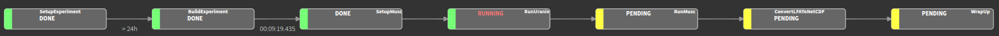

<div align="center">

# <code>[UranMusc](https://github.com/mafdmi/UranMusc)</code><br>Running MUSC in the Uranie framework

</div>
Repo for running MUSC in Uranie framework

## System requirements
- Python >=3.10,< 3.13
- [uv](https://docs.astral.sh/uv/); python package manager. Install by executing `curl -LsSf https://astral.sh/uv/install.sh | sh`

## Installation
This, naturally, assumes your system fulfills all [requirements](#system-requirements).

To get everything set, please run
```shell
# Clone repo
git clone git@github.com:<FORK_NAME>/UranMusc.git
cd UranMusc
```
, where `<FORK_NAME>` is the name of your fork of the [UranMusc](https://github.com/mafdmi/UranMusc) repo.

Then, install the environment

```shell
module load ecmwf-toolbox
module load python3/3.10.10-01
uv venv --system-site-packages
uv sync --all-extras
```

The package uses pre-commit to enforce specific style conventions. To install it, run
```shell
uv run pre-commit install
```

## Basic Usage
The UranMusc package uses the [Luigi package](https://luigi.readthedocs.io/en/latest/index.html) to build a pipeline of tasks that are
needed to run a MUSC experiment.

Upon succesfull installation, you should therefore be able to run
```shell
uv run uranmusc [TASK_NAME] [subcommand_opts] --help
```
where `[TASK_NAME]` is the name of one of the available tasks, and `[subcommand_opts]` denote command line arguments
that apply to the given task. The available tasks are

- **CloneRepos** : Clone git repositories specified in the config at `git_repos.<repo>`.
- **SetupExperiment** : Set up a Harmonie experiment using the cloned Harmonie repository.
- **BuildExperiment** : Build Harmonie
- **SetupMusc** : Set up MUSC using the built Harmonie code and generate namelists.
- **RunUranie** : Run URANIE to generate "perturbed" namelists.
- **RunMusc** : Run MUSC on the generated namelists.
- **ConvertLFAToNetCDF** : Convert the output .lfa files to netCDF.
- **WrapUp** : Wrap up the experiment by adjusting group permissions among other things.

The tasks are organized in a pipeline that controls the dependencies between the tasks.



Luigi automatically checks if task dependencies are complete before running a task. If it discovers incomplete task dependencies, it will run them before running the requested task. All completed tasks will not rerun unless explicitly requested using either the `--rerun` (single task) or `--rerun-all` flag.

As an example, to run the `RunMusc` task, you would run
```shell
uv run uranmusc RunMusc [--scheduler-port 8082|--local-scheduler]
```

The `--scheduler-port` flag is used to specify the port on which the Luigi server is running (see [Start Luigi server and port-forward](#start-luigi-server-and-port-forward]). The `--local-scheduler` flag is used to run the Luigi server locally. Use the latter option, if you don't want to see the status of the pipeline in the Luigi server GUI.

## Start Luigi server and port-forward

To see the status of the pipeline in a Luigi server on ATOS, you need to start the server before running any task. To do so, run
```shell
uv run --active luigid --address 127.0.0.1 --port 8082
```

To port-forward the Luigi server to your local machine, run locally
```shell
ssh -L 8080:127.0.0.1:8082 hpc-login
```

Now, you should be able to see the status at `http://127.0.0.1:8080/`.
